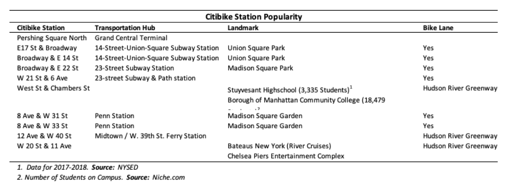

# Citibike Metrics

## Project description

The purpose of this project is to aggregate, describe and analize phenomena found in the Citibike program in New York City.

## Toos Used

1. Python (Data Aggregation)

    - Pandas Library

2. Tableau (Visualization and Analysis)

3. Github (Publishing of Results and Analysis)

## Link to the visualizations

- [Tableau Public](https://public.tableau.com/profile/cesar.mosquera#!/vizhome/Citibike_15789352935200/CitibikeProgramMetrics-Story).

### Steps

1. Use of `Python` to aggregate data from the [Citibike Data Page](https://s3.amazonaws.com/tripdata/index.html). Files from 2017 until the end of 2019 were used

    - The `CSV` files in the `data_original` folder were uploaded to `Pandas Pandas DataFrames`
    - The headers of the `Pandas DataFrames` were changed to be the same for all the `CSV` files
    - The `Pandas DataFrames` with the standardized headers were exported to the `data_modified` folder
    - The `CSV` files in the modified folder were uploaded to a single `Pandas DataFrame`

2. Elimination of outliers. By using `Python`, bike rides taking longer than 3 hours were eliminated as outliers. After pre-analysis, these trips were made to maintenance stations, were out of the scope of the analysis and distorted the conclusions

    - The `Pandas DataFrame` containing the data of all the months was filtered to eliminate the outliers
    - New aggregated `Pandas DataFrames` were created summarizing the data by `costumer tye and gender`, by `starting station name` and for `stoping station name
    - Small `CSV` files, the product of the aggregation, were exported to the `data_output` folder

3. Use of `Tableau` to describe and analyze the phenomena from the data by creating `visualizations`, `dashboards`, and a `story`

### Screenshots

### Analysis

#### Station Popularity

The most popular Citibike stations are next to huge transportation hubs (Grand Central Terminal and Penn Station) and have bike lanes nearby. This situation is summarized in the chart below for the most popular Citibike Stations for the timespan of the analysis.

#### Trends

- The Citibike program reported more rides during the summer months and increased progresively to the warmer months of the year.

#### Type of Consumer

1. The subscribers take most of the Citibike program rides
2. Subscriber rides take less than 15 minutes while Costumer rides are over 20 minutes.
3. According to the data, the subscribers use the program for commuting, while the subscribers use it for sightseen.

#### Gender

1. Men use the program much more than women. This could be explained by the fact that the clothing of women commuters make riding a bike more dificult. Non-Commuter women is a small proportion of the total rides.
2. Women take a couple of minutes more than men consistently. This could be because women in general are more cautious  than men.

#### Age

1. More than a third of the bike rides are taken by people between 25 and 35 years old.
2. In general, people over 45 years old spend one minute less on a bike ride on average. This could be because they don't want to spend as much time as younger people.
3. People who are between 45 and 55 years old, take one minute longer than younger people. This could be because it takes longer for them to cover the same distances than younger people.
4. Groups of people in the age groups of 25 to 35 and 35 to 45 years old. take bike rides of a very similar duration.
5. Younger people from 15 to 25 use the program the least. This could be because they own their bikes or the bike program is under an adult name in the case of people younger than 21.
